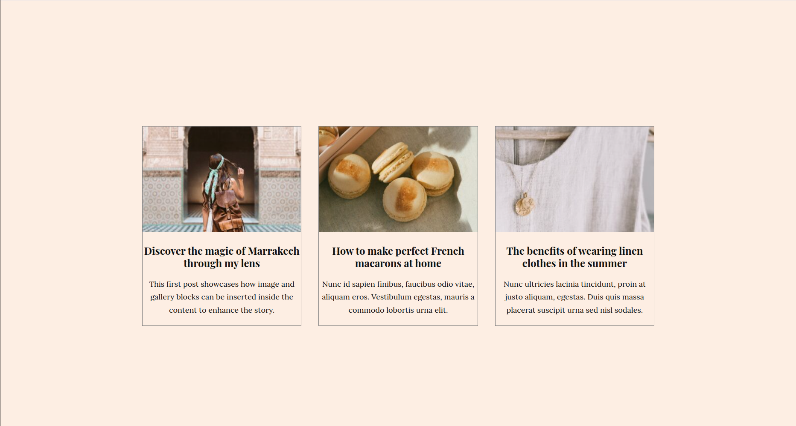

# **Task 3: Webpage: Valencia**
Welcome to the third task. Most of the instructions from the first tasks also apply here.

## **Getting Started**

### **Setting Up the Project**
1. **Create a New Vite Project**:
   - Run the following commands to create a new Vite project:
     ```bash
     npm create vite
     cd my-webpage # choose a name of your liking.
     npm install
     ```

2. **Install Dependencies**:
   - If you need additional libraries, you will install them using:
     ```bash
     npm install <library-name>
     ```

3. **Start the Development Server**:
   - Run the following command to start the development server:
     ```bash
     npm run dev
     ```
   - Open the provided local URL (e.g., `http://localhost:5173`) in your browser to view your app.

4. **Webpage**:
    - Here is the webpage
    

   - The background color for the page is "#fdeee3"
   - You can use the following text for the
     First card content:
     ```
     Image: https://demo.twentig.com/valencia/wp-content/uploads/sites/10/2021/03/blog-15-768x432.jpg
     Title: Discover the magic of Marrakech through my lens
     Subtitle: This first post showcases how image and gallery blocks can be inserted inside the content to enhance the story.
     ```
     
     Second card content:
     ```
     Image: https://demo.twentig.com/valencia/wp-content/uploads/sites/10/2021/03/blog-01-768x432.jpg
     Title: How to make perfect French macarons at home
     Subtitle: Nunc id sapien finibus, faucibus odio vitae, aliquam eros. Vestibulum egestas, mauris a commodo lobortis urna elit.
     ```
     
     Third card content
     ```
     Image: https://demo.twentig.com/valencia/wp-content/uploads/sites/10/2021/03/blog-03-768x432.jpg
     Title: The benefits of wearing linen clothes in the summer
     Subtitle: Nunc ultricies lacinia tincidunt, proin at justo aliquam, egestas. Duis quis massa placerat suscipit urna sed nisl sodales.
     ```

---
### **Good Luck!**
    Feel free to ask questions or get back to me if you encounter any issues. Happy coding! 🚀
