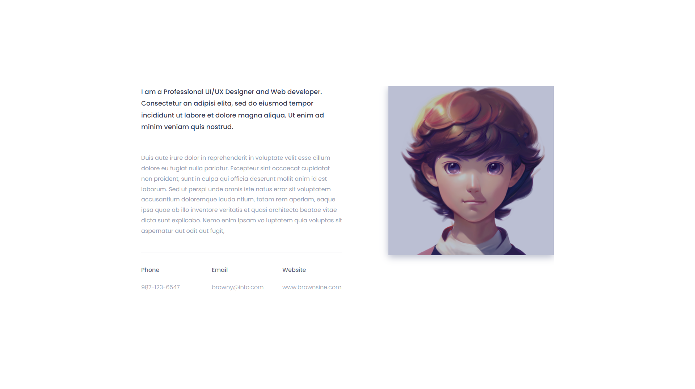

# **Frontend Task 2: Webpage**
Welcome to the second task. Most of the instructions from the first tasks also apply here.

---

## **Getting Started**

### **Setting Up the Project**
1. **Create a New Vite Project**:
   - Run the following commands to create a new Vite project:
     ```bash
     npm create vite
     cd my-webpage # choose a name of your liking.
     npm install
     ```

2. **Install Dependencies**:
   - If you need additional libraries, you will install them using:
     ```bash
     npm install <library-name>
     ```

3. **Start the Development Server**:
   - Run the following command to start the development server:
     ```bash
     npm run dev
     ```
   - Open the provided local URL (e.g., `http://localhost:5173`) in your browser to view your app.

4. **Webpage**:
    - Here is the webpage
    

   - The image that is on the webpage can be found here: https://static.vecteezy.com/system/resources/thumbnails/019/900/306/small_2x/happy-young-cute-illustration-face-profile-png.png


### **Good Luck!**
    Feel free to ask questions or get back to me if you encounter any issues. Happy coding! 🚀
---


### **Good Luck!**
Feel free to ask questions or get back to me if you encounter any issues. Happy coding! 🚀

---
