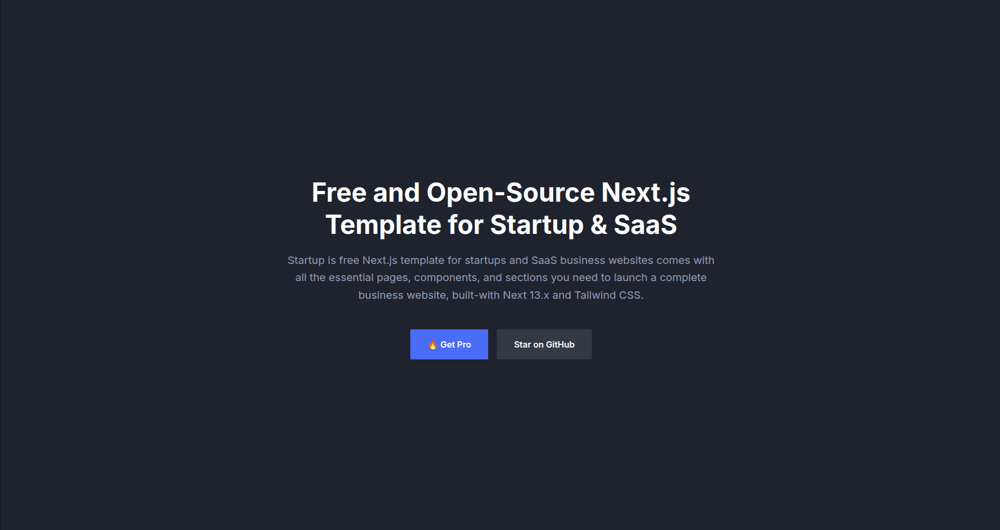

# **Frontend Task 1: Webpage Implementation**

Hey! In this task, you will implement a webpage based on the provided design image. Follow the instructions below to get started. We have already done most of the steps but you can go through them again to get familiar.

---

## **Overview**
You have been provided with an image of a webpage design. Your task is to recreate the webpage using **React** and **Vite**. Focus on replicating the layout and styles, as closely as possible.

---

## **Getting Started**

### **Setting Up the Project**
1. **Create a New Vite Project**:
   - Run the following commands to create a new Vite project:
     ```bash
     npm create vite
     cd my-webpage # choose a name of your liking.
     npm install
     ```

2. **Install Dependencies**:
   - If you need additional libraries, you will install them using:
     ```bash
     npm install <library-name>
     ```

3. **Start the Development Server**:
   - Run the following command to start the development server:
     ```bash
     npm run dev
     ```
   - Open the provided local URL (e.g., `http://localhost:5173`) in your browser to view your app.

4. **Webpage**:
    - Here is the image file
    


### **Good Luck!**
    Feel free to ask questions or get back to me if you encounter any issues. Happy coding! 🚀
---
---

### **Uploading Your Code to GitHub**

Follow these steps to upload your project to GitHub once you are done:

1. **Create a New Repository**:
   - Go to [GitHub](https://github.com) and log in to your account.
   - Click on the "+" icon in the top-right corner and select "New repository."
   - Give your repository a name (e.g., `webpage-implementation`) and make it public.
   - Do **not** initialize the repository with a README, `.gitignore`, or license file.

2. **Exclude `node_modules`**:
   - To avoid uploading the `node_modules` folder, add the following line to the file `.gitignore`:
     ```
     node_modules/
     ```
   - This ensures that the `node_modules` folder is ignored when pushing your code to GitHub.

3. **Upload files to github**:
    - Upload your files to github once you are done. You can do this by drag and drop. Ensure you don't drag and drop the folder title `node_modules` but the rest
    you can do so.

4. **Verify Your Upload**:
   - Visit your GitHub repository page to confirm that your code has been uploaded successfully.

---

### **On my side**
To check what you have done. On my side, I will:
1. Clone your repository.
2. Install dependencies using `npm install`.
3. Run the app locally using `npm run dev` to check out what you designed.
4. Be sure to let me know once you are done.
5. Share a link to your github repository. You can copy this from the browser tab.

---

### **Good Luck!**
Feel free to ask questions or get back to me if you encounter any issues. Happy coding! 🚀

---