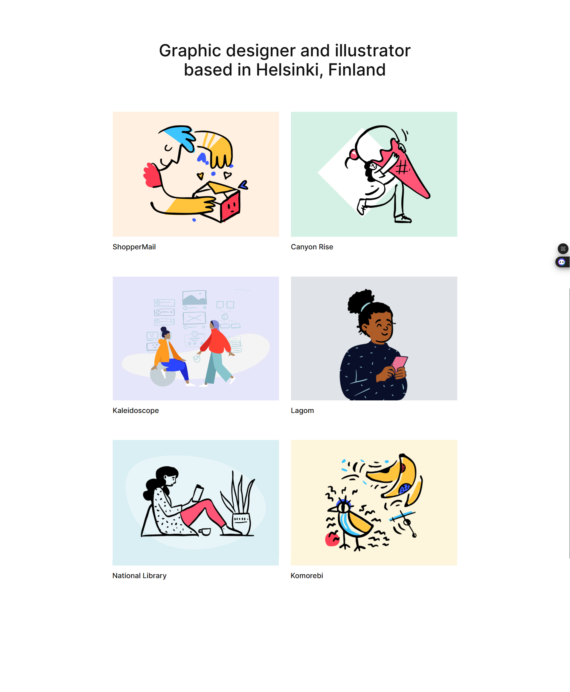

# **Task 4: Portfolio: Designer**
Welcome to the fourth task. Most of the instructions from the first tasks also apply here.

## **Getting Started**

### **Setting Up the Project**
1. **Create a New Vite Project**:
   - Run the following commands to create a new Vite project:
     ```bash
     npm create vite
     cd my-webpage # choose a name of your liking.
     npm install
     ```

2. **Install Dependencies**:
   - If you need additional libraries, you will install them using:
     ```bash
     npm install <library-name>
     ```

3. **Start the Development Server**:
   - Run the following command to start the development server:
     ```bash
     npm run dev
     ```
   - Open the provided local URL (e.g., `http://localhost:5173`) in your browser to view your app.

4. **Webpage**:
    - Here is the webpage. To be able to obtain that ordering, search about flex-wrap and wrap.
    

   - The background color for the page is "#f9f9f9"
   - The images on the page are listed below (ordered):
     1. https://demo.twentig.com/tt4-portfolio/wp-content/uploads/sites/17/2024/01/shoppermail-01-1024x576.png
     2. https://demo.twentig.com/tt4-portfolio/wp-content/uploads/sites/17/2024/01/canyonrise-01-1024x576.png
     3. https://demo.twentig.com/tt4-portfolio/wp-content/uploads/sites/17/2024/01/kaleidoscope-01-1024x576.png
     4. https://demo.twentig.com/tt4-portfolio/wp-content/uploads/sites/17/2024/01/lagom-01-768x432.png
     5. https://demo.twentig.com/tt4-portfolio/wp-content/uploads/sites/17/2024/01/national-library-01-768x432.png
     6. https://demo.twentig.com/tt4-portfolio/wp-content/uploads/sites/17/2024/01/komorebi-01-768x432.png


---
    Happy coding! 🚀
